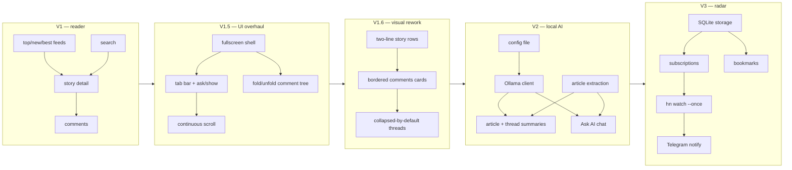

# hn-bits specs

Terminal-first Hacker News client (`hn` binary). Specs versioned by release; each version folder is self-contained enough to implement cold.

## Status

| Version | Theme | Status | Specs |
|---------|-------|--------|-------|
| V1 | Browse + search + comments | **done** | [v1/](v1/00-overview.md) |
| V1.5 | UI overhaul: fullscreen TUI, tabs, comment tree, theme palettes | **done** | [v1.5/](v1.5/00-overview.md) |
| V1.6 | Visual rework: two-line story rows, bordered comments cards, collapsed-by-default threads, tab bar + polish + loader, comments polish (colors, fold states, contacts), navbar rule + selection/fold follow-ups | phases 1–7 done, phase 8 spec'd | [v1.6/](v1.6/01-story-row-layout.md) |
| V2 | Local AI: summaries + Ask AI (Ollama) | spec'd | [v2/](v2/00-overview.md) |
| V3 | Subscriptions + watcher + Telegram + SQLite + bookmarks | spec'd | [v3/](v3/00-overview.md) |

## Roadmap

## Ground rules (all versions)

- Personal tool, single user. Node.js ESM + TypeScript + Ink (React terminal UI). Native `fetch`.
- Dependencies added only when a version needs them (V2: `@mozilla/readability`, `jsdom`; V3: `better-sqlite3`).
- Config file and database appear only when first needed (config in V2, SQLite in V3). V1 is fully stateless.
- Later-version specs may adjust keybindings only by **adding** keys; existing bindings stay stable. V1.5 is a sanctioned one-time break (Enter semantics, pagination removal, StoryDetail deletion — see [v1.5/06-keybindings.md](v1.5/06-keybindings.md)); the add-only rule resumes from the V1.5 baseline.
