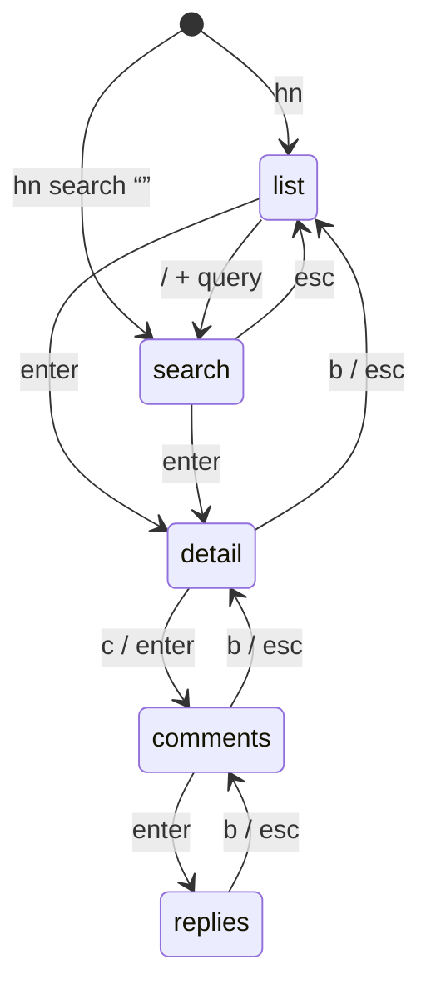
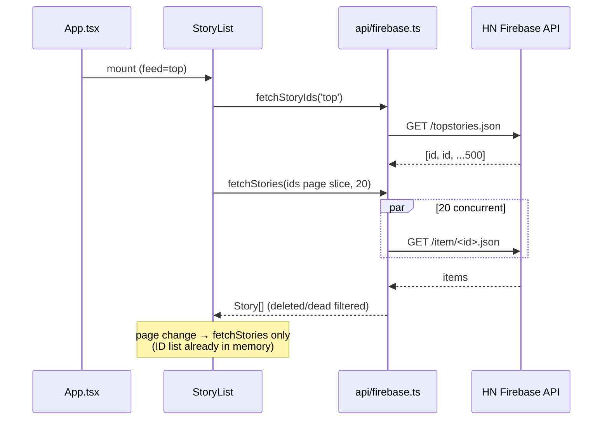

# Architecture

## Module layout

```text
src/
├── api/
│   ├── firebase.ts    # top/new/best story IDs + batch story items
│   └── algolia.ts     # search + full comment trees
├── ui/
│   ├── App.tsx        # view router (list → story → comments)
│   ├── StoryList.tsx
│   ├── StoryDetail.tsx
│   └── Comments.tsx   # flat top-level, drill-in for replies
├── lib/
│   └── html.ts        # entity decode, <p>/<a>/<code> handling for comment text
└── index.tsx          # commander entry: `hn`, `hn search <q>`
```

## Entry point (`src/index.tsx`)

Commander parses argv, then hands off to a single Ink `render(<App …/>)` call:

- `hn` → App starts in **list** view, feed `top`.
- `hn search <query>` → App starts in **search results** view for `<query>`.
- `--help` / `--version` handled by Commander; no other subcommands in V1.

## View state machine (`App.tsx`)

App owns a small navigation state — no router library:



Search results behave exactly like `list` (same component, different data source); `q` quits from any state.

- Navigation state: `{ view, feed, selectedStory?, selectedComment?, searchQuery? }`.
- Back (`b`/`esc`) pops one level; from top-level list it does nothing; `q` quits from anywhere.
- Each view is a separate component receiving data + callbacks via props. No global state store.

## Data flow



- Views fetch their own data via `src/api/*` on mount (useEffect), render a loading line while pending, and an error line with the message on failure.
- API modules return typed plain objects (`Story`, `CommentNode`); no caching layer in V1 (stateless).
- HTTP: native `fetch`; non-2xx responses throw `Error("<status> <statusText> for <url>")`.

## Shared types

`Story` is defined in `api/firebase.ts` and reused by Algolia search results (both APIs are mapped into this one shape):

```ts
interface Story {
  id: number;
  title: string;
  url?: string;        // absent for Ask HN / text posts
  by: string;
  score: number;
  descendants: number; // comment count
  time: number;        // unix seconds
}
```

## Build & run

- Dev: `npm run dev` (tsx, no build step).
- Build: `npm run build` (tsc → `dist/`), `bin` maps `hn` → `dist/index.js`.
- Global: `npm link`.
