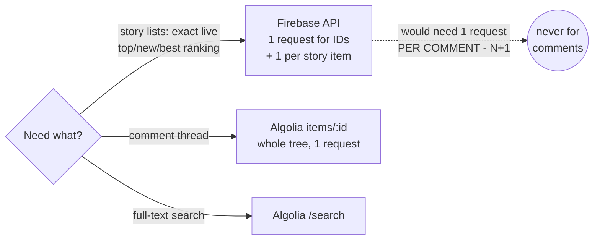

# Algolia API (`src/api/algolia.ts`)

Algolia HN Search API. Two jobs: **full comment trees in one request** and **full-text search**.

Base URL: `https://hn.algolia.com/api/v1`

## Why two APIs — routing rule



Firebase has no bulk endpoint, so a 500-comment thread would cost 500 requests; Algolia returns the same tree nested in one response. Conversely Algolia's front-page ranking lags, so live feeds stay on Firebase.

## 1. Comment trees — `GET /items/:id`

Returns the story item with its **entire comment tree nested** in `children`. One HTTP request per story regardless of comment count — this is why comments don't go through Firebase.

```ts
interface CommentNode {
  id: number;
  author: string;
  text: string;        // raw HTML from API; decoded at render time (lib/html.ts)
  time: number;        // unix seconds (created_at_i)
  children: CommentNode[];
}

fetchComments(storyId: number): Promise<CommentNode[]>  // top-level comments
```

Mapping rules:

- Keep only nodes with `type === 'comment'` and non-null `author` and `text` (deleted/dead comments come back with nulls) — dropped **recursively**, their subtrees included only via surviving parents.
- `text` is stored as-is (HTML); decoding is the UI/`lib/html.ts` concern, not the API layer's.

Trade-off (accepted): Algolia index lags live HN by a few minutes; very fresh comments may be missing. Fine for a reader.

## 2. Search — `GET /search`

Relevance-ranked story search (`tags=story`, `hitsPerPage=20`, zero-based `page`).

```ts
interface SearchResult {
  stories: Story[];   // mapped into the shared Story shape
  hasMore: boolean;   // page + 1 < nbPages
}

searchStories(query: string, page = 0): Promise<SearchResult>
```

Mapping: `objectID → id (Number)`, `points → score`, `num_comments → descendants`, `created_at_i → time`; hits without `title` dropped; null `author`/`points`/`num_comments` default like Firebase mapping.

`search` (relevance) chosen over `search_by_date` for V1 — looking things up, not monitoring. No filters (date ranges, points) in V1.

## Errors

Same policy as Firebase module: non-2xx throws with status + URL; view renders the message. No retry.
