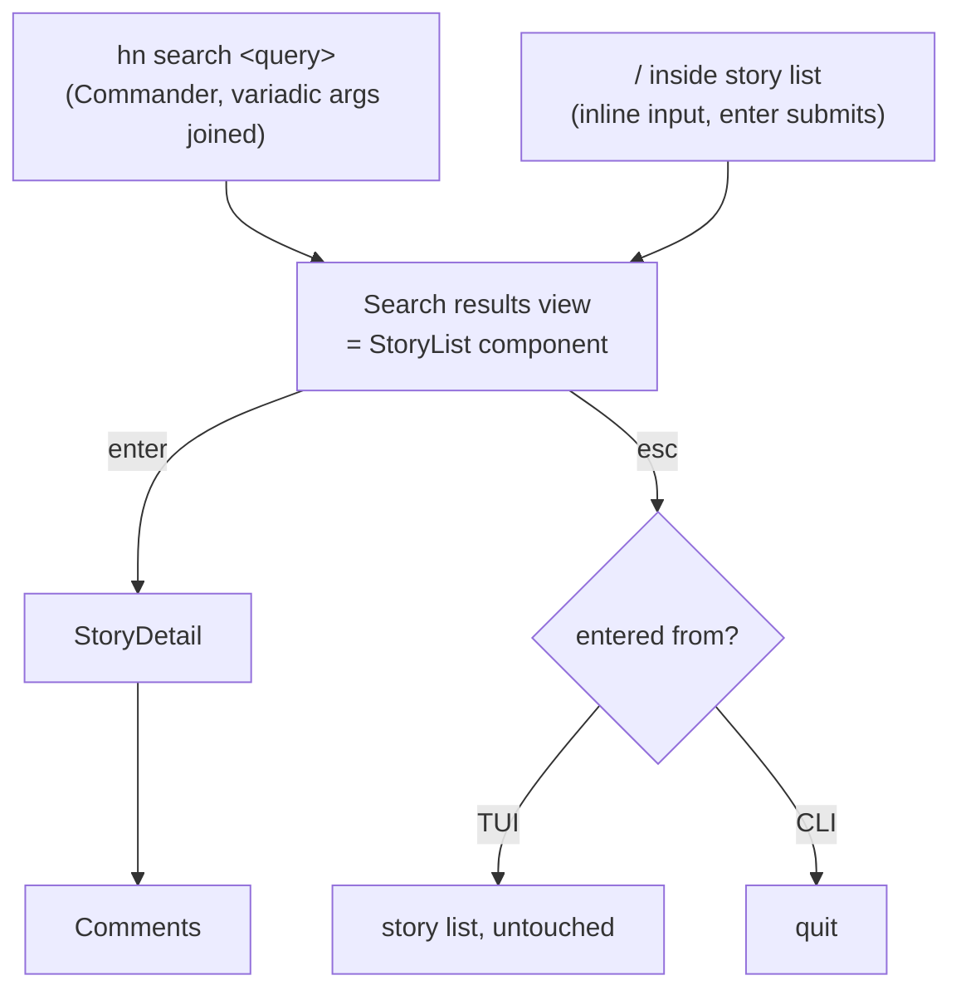

# Search

Backed by Algolia `searchStories` ([03-api-algolia.md](03-api-algolia.md)). Two entry points, one result experience.



## Entry point 1 — CLI

```bash
hn search <query...>
```

- Commander subcommand; variadic args joined with spaces (`hn search rust async` → `"rust async"`).
- Launches the TUI directly in search-results view for that query.

## Entry point 2 — inside TUI

- `/` from the story list opens an inline query input (Ink text input at the footer position).
- `enter` submits → search-results view. `esc` cancels input, back to list untouched.

## Results view

Reuses **StoryList** component: same row format, same keys, same pagination (Algolia `page` param + `hasMore`), header shows `search: <query>` instead of feed name. Selection flows into the same StoryDetail → Comments views.

Differences from feed list:

- Feed-switch keys (`t`/`n`/`b`) inactive.
- `esc` from search results returns to the regular list (if TUI-entered) or quits (if CLI-entered — list below it never existed).
- `/` again starts a new search.

## Non-goals (V1)

No search filters (date range, points, author), no `search_by_date` mode, no comment search, no history.
