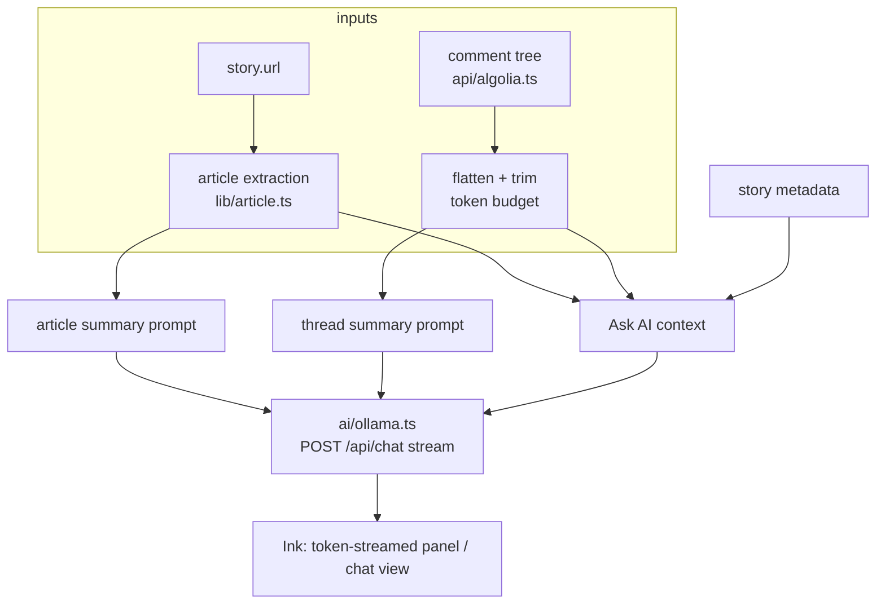

# V2 — Local AI (Ollama)

Adds local-AI reading aids on top of the V1 reader: **summaries** (article and comment thread) and **Ask AI** (interactive Q&A grounded in the story + thread). Everything runs against a local Ollama instance — no cloud calls, no API keys.

Prerequisite: V1 complete ([../v1/00-overview.md](../v1/00-overview.md)).

## V2 scope

1. **Config file** — first persistent artifact: `~/.config/hn-bits/config.json` (Ollama endpoint + model). App works fully without it; AI features degrade to a setup hint.
2. **Ollama client** — `src/ai/ollama.ts`: streaming chat, health check, clear error taxonomy.
3. **Article extraction** — `src/lib/article.ts`: fetch story URL, Readability, plain text with fallbacks.
4. **Summaries** — `s` in StoryDetail (article) and in Comments (thread), streamed into a panel.
5. **Ask AI** — `a` opens a chat view with story + article + thread as context, multi-turn within the session.

## Out of V2

Bookmarks, subscriptions, watcher, notifications, SQLite (all V3). Cloud LLM providers. Persisting chat history or summaries (stateless beyond the config file). Summarizing individual comments. Model management (pulling models is the user's job via `ollama pull`).

## Pipeline overview



## New dependencies

| Package | Why |
|---------|-----|
| `@mozilla/readability` | article body extraction |
| `jsdom` | DOM for Readability |

## New modules

```text
src/
├── ai/
│   └── ollama.ts      # chat streaming, health check, errors
├── lib/
│   ├── article.ts     # fetch + Readability → plain text
│   └── config.ts      # load/validate config file
└── ui/
    ├── SummaryPanel.tsx
    └── AskAI.tsx
```

## Spec index

| File | Covers |
|------|--------|
| [01-config.md](01-config.md) | Config file location, schema, defaults, no-config behavior |
| [02-ollama-client.md](02-ollama-client.md) | Chat API, streaming, health check, error taxonomy |
| [03-article-extraction.md](03-article-extraction.md) | Fetch, Readability, fallback chain, truncation |
| [04-summaries.md](04-summaries.md) | `s` key, panel layout, prompts, thread trimming |
| [05-ask-ai.md](05-ask-ai.md) | `a` key, chat view, context assembly, streaming UX |
