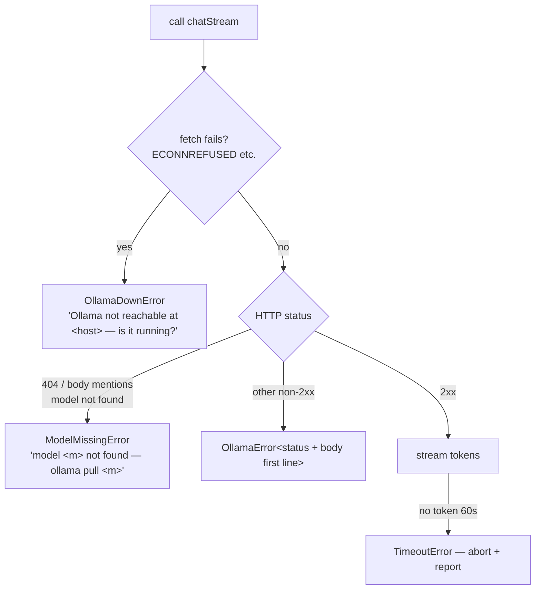

# Ollama client (`src/ai/ollama.ts`)

Thin typed client over the local Ollama HTTP API. Native `fetch` streaming — no SDK dependency.

## Endpoints used

| Endpoint | Use |
|----------|-----|
| `POST /api/chat` | all generation (summaries + Ask AI), `stream: true` |
| `GET /api/tags` | health check + model presence |

## Exports

```ts
interface ChatMessage {
  role: 'system' | 'user' | 'assistant';
  content: string;
}

// Yields content deltas as they arrive; caller accumulates.
chatStream(
  cfg: Config['ollama'],
  messages: ChatMessage[],
  signal?: AbortSignal,
): AsyncGenerator<string>

// Health probe. Distinguishes "server down" from "model missing".
checkOllama(cfg: Config['ollama']): Promise<
  | { ok: true }
  | { ok: false; reason: 'down' | 'model-missing'; detail: string }
>
```

## Streaming protocol

`/api/chat` with `stream: true` returns **NDJSON** — one JSON object per line, each with `message.content` delta, final line has `done: true`:

```jsonc
{"message":{"role":"assistant","content":"The"},"done":false}
{"message":{"role":"assistant","content":" article"},"done":false}
{"done":true, "total_duration": ...}
```

Implementation: read `res.body` via async iterator, buffer partial lines across chunks, `JSON.parse` complete lines, yield `message.content` when non-empty, return on `done: true`.

Request body:

```json
{ "model": "<cfg.model>", "messages": [...], "stream": true }
```

## Cancellation

`AbortSignal` threaded into `fetch`. UI aborts on `esc` during streaming; generator must exit cleanly on `AbortError` (caller treats as cancelled, not failed).

## Error taxonomy



- Errors are typed classes (`OllamaDownError`, `ModelMissingError`, `OllamaError`, all extending `Error`) so the UI can render tailored hints.
- Idle timeout: 60 s without a delta → abort with timeout message. No overall cap (long summaries on slow hardware are legitimate).
- No retry in the client; user re-presses the key.

## Non-goals

Model pulling/listing UI, temperature/options tuning (Ollama defaults), `/api/generate` (chat endpoint covers all uses), multiple concurrent generations (one in flight per app; new request aborts the previous).
