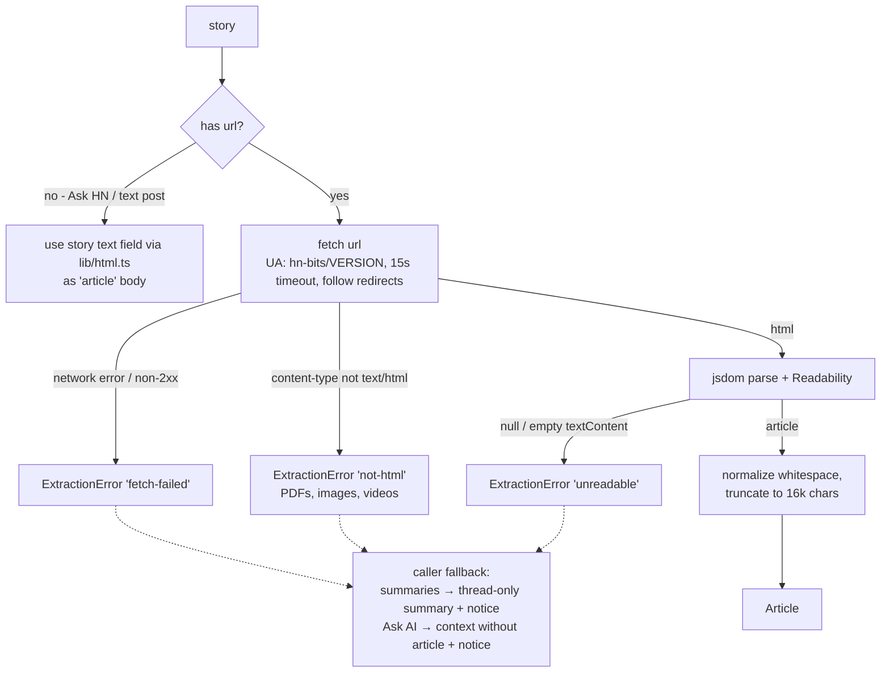

# Article extraction (`src/lib/article.ts`)

Turns a story URL into plain text for prompting. Used by article summaries ([04-summaries.md](04-summaries.md)) and Ask AI context ([05-ask-ai.md](05-ask-ai.md)). Never shown to the user directly in V2 (no read-article-in-terminal view).

## Dependencies

`@mozilla/readability` (extraction) + `jsdom` (DOM it requires). Both imported **lazily** (dynamic `import()`) inside `extractArticle` — jsdom is heavy and must not slow down plain-reader startup.

## Export

```ts
interface Article {
  title: string;
  text: string;       // plain text, paragraphs joined by \n\n, truncated to budget
  truncated: boolean;
}

extractArticle(url: string, signal?: AbortSignal): Promise<Article>
// throws ExtractionError with a reason — caller decides fallback
```

## Pipeline & fallback chain



## Rules

- **Fetch:** 15 s `AbortSignal.timeout` (merged with caller signal), `User-Agent: hn-bits/<version>`, `Accept: text/html`. Response body capped at 2 MB (stop reading past it) — guards against huge pages.
- **HTML gate:** proceed only when `content-type` contains `text/html`; otherwise `not-html` (typical for PDF links, YouTube handled as unreadable/not-html — fine).
- **Extraction:** `new JSDOM(html, { url })` (Readability needs base URL for relative links) → `new Readability(doc).parse()`. Use `.textContent`, not `.content` (no HTML needed downstream).
- **Normalization:** collapse runs of blank lines, trim; paragraphs separated by `\n\n`.
- **Budget:** truncate to **16 000 chars** (~4k tokens) at the nearest paragraph boundary; set `truncated: true`. Keeps total prompt within small-local-model context comfortably.
- **jsdom noise:** run JSDOM with `runScripts` disabled (default) and swallow its console/css errors (`virtualConsole` muted) — broken CSS on random sites must not print over the TUI.

## Error type

```ts
class ExtractionError extends Error {
  reason: 'fetch-failed' | 'not-html' | 'unreadable';
}
```

Callers never crash on it — every consumer has a defined fallback (diagram above). Message text surfaces in the notice line, e.g. `article unavailable (not-html) — summarizing thread only`.
