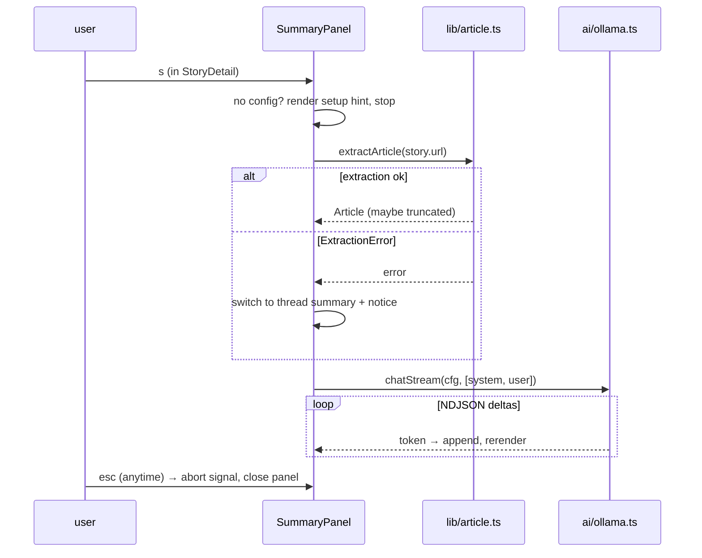

# Summaries (`src/ui/SummaryPanel.tsx`)

`s` key, context-dependent:

- **StoryDetail** → **article summary** (extracted page text).
- **Comments** → **thread summary** (trimmed comment tree).

Both stream into the same panel component overlaying the lower half of the view.

## Layout

```text
 ┌ story detail or comments view (top, unchanged) ────────────┐
 │ …                                                          │
 ├─ summary · llama3.2 ────────────────────────────────────────┤
 │ The article announces PostgreSQL 18, focusing on…          │
 │ ▍(streaming cursor while generating)                       │
 │                                                            │
 │ article truncated to 16k chars                             │  ← notice line, only when relevant
 └─ esc close · s regenerate · j/k scroll ─────────────────────┘
```

- Panel takes bottom ~50% of rows; parent view stays visible above (dimmed).
- Header: `summary · <model>`. While waiting for first token: `summary · <model> · thinking…`.
- Text wraps to width; `j`/`k` scroll when content exceeds panel (after generation completes).
- Notice line (dim, above footer) reports fallbacks: truncation, extraction failure, thread trimming.

## Flow



## Prompts

System (both kinds):

```text
You are a concise assistant summarizing Hacker News content. Plain text only, no markdown headers. Max ~150 words.
```

Article user prompt:

```text
Summarize this article in 3-5 sentences, then list 2-3 key takeaways as short dashes.

Title: {story.title}

{article.text}
```

Thread user prompt:

```text
Summarize this Hacker News discussion: main viewpoints, notable disagreements, and any strong consensus. 4-6 sentences.

Story: {story.title}

Comments:
{trimmed thread}
```

## Thread trimming (shared with Ask AI — helper in `src/ai/context.ts`)

Comment tree → prompt text under budget:

1. Walk top-level comments **in API order** (Algolia preserves HN rank ≈ quality).
2. Per top-level comment include: the comment + its replies to **depth ≤ 2**, each rendered as `{author}: {text}` with 2-space indent per level, HTML → text via existing `lib/html.ts`.
3. Cap each comment's text at 1 000 chars (ellipsis).
4. Stop adding comments when total hits **12 000 chars**; note `thread trimmed to first N comments`.

```ts
buildThreadContext(comments: CommentNode[]): { text: string; includedTopLevel: number; trimmed: boolean }
```

## Keys (while panel open — panel captures input)

| Key | Action |
|-----|--------|
| `esc` | abort generation (if running) + close panel, parent view untouched |
| `s` | regenerate (abort current, restart) |
| `j` / `k` | scroll panel content |
| `q` | quit app (aborts stream) |

## Errors

Ollama errors render their tailored hint in the panel body (from error taxonomy in [02-ollama-client.md](02-ollama-client.md)); `s` retries. Nothing is cached — every `s` regenerates (stateless V2).
