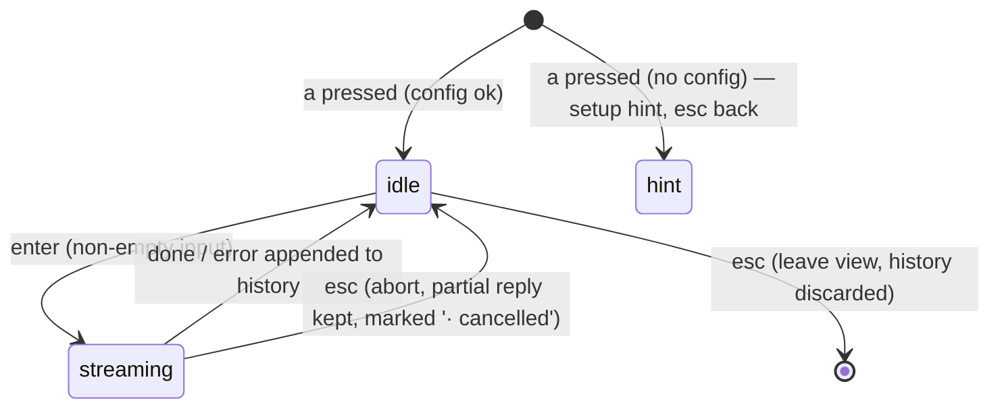

# Ask AI (`src/ui/AskAI.tsx`)

`a` from **StoryDetail** or **Comments** opens a full-screen chat grounded in the story. Multi-turn within the session; nothing persists after leaving the view.

## Layout

```text
 ask · Postgres 18 released · llama3.2

 you  What's the main complaint in the thread?
 ai   Most critical comments focus on the new default
      for checksums, arguing that…

 you  Did anyone benchmark it?
 ai   ▍(streaming)

 ──────────────────────────────────────────────────
 > ask something_
 enter send · esc back · ctrl+c quit
```

- Header: `ask · <story title, truncated> · <model>`.
- History: alternating `you`/`ai` turns, wrapped; auto-scrolls to bottom while streaming; `j`/`k`(or wheel-less scroll via arrows) scroll history **when input is empty**.
- Input line always at bottom (Ink text input). While a reply streams, input is disabled (dim) — one generation in flight.

## View state



`esc` is contextual: streaming → abort only; idle → leave the view. Leaving returns to whichever view (`detail` or `comments`) launched it.

## Context assembly (`src/ai/context.ts`)

Built once when the view opens, reused for every turn:

```text
system:
  You are answering questions about a Hacker News story and its discussion.
  Base answers only on the provided material; say so when it doesn't contain the answer.

  Story: {title} ({url or 'text post'}) — {score} points, {descendants} comments

  Article:
  {article.text | 'unavailable: <reason>'}

  Discussion:
  {buildThreadContext(comments).text | 'not loaded'}
```

- **Article:** `extractArticle` attempted on open (spinner in header while fetching); failure degrades to `unavailable` — chat still works.
- **Thread:** if launched from Comments, tree already in memory. If launched from StoryDetail, fetch it (`fetchComments`) in the same opening phase — Q&A about discussion is the main use case, so always include it.
- Same 16k article / 12k thread budgets as summaries ([04-summaries.md](04-summaries.md)).

Message list sent per turn: `[system+context, ...history turns, new user message]`. History grows unbounded within the session — acceptable; long chats may exceed model context, Ollama truncates from the front (known trade-off, noted, not mitigated in V2).

## Keys

| Key | State | Action |
|-----|-------|--------|
| any printable | idle | type into input |
| `enter` | idle, input non-empty | send turn, start streaming |
| `esc` | streaming | abort; keep partial text, mark `· cancelled` |
| `esc` | idle | leave view (history discarded) |
| `↑`/`↓` | idle, input empty | scroll history |
| `ctrl+c` | any | quit app |

Note: inside this view letters go to the input, so global `q`-to-quit doesn't apply — `ctrl+c` (Ink default) quits.

## Errors

Ollama errors append as an `ai` turn with the tailored hint text (dim/red); user can resend. Health check (`checkOllama`) runs on view open — `down`/`model-missing` render as hint immediately rather than failing on first send.
