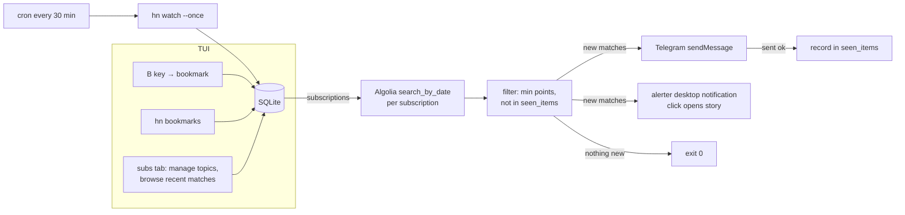

# V3 — Radar (subscriptions, watcher, notifications, bookmarks)

Turns the reader into the "radar" from the original concept: subscribe to topics, a cron-driven one-shot watcher finds new matching stories, Telegram delivers them. SQLite arrives as the first database (subscriptions, dedup, bookmarks).

Prerequisites: V1.6 complete; V2 config file exists ([../v2/01-config.md](../v2/01-config.md)) — V3 extends the same file.

## V3 scope

1. **SQLite storage** — `better-sqlite3`, single DB file; tables: `subscriptions`, `seen_items`, `bookmarks`.
2. **Subscriptions** — named topic queries (Algolia query + min-points), CRUD via `hn sub` CLI and a 7th **subs** tab in the TUI (manager, per-topic matches browsing, live-preview form, subscribe-from-search).
3. **Watcher** — `hn watch --once`: query each subscription, dedup, notify, exit. Scheduled by the OS (cron/launchd), not a daemon.
4. **Notifications** — Telegram bot API `sendMessage` + optional macOS desktop via `alerter` (click opens story); notifier interface keeps Discord addable later.
5. **Bookmarks** — `B` toggles bookmark on a story; a 6th **saved** tab lists them; `hn bookmarks` opens the TUI on that tab.

## Out of V3

Discord (interface-ready, not implemented), long-running daemon mode, notification digests/batching windows, desktop notification reply/dropdown actions (click-to-open is in), non-macOS desktop notifications, comment-level subscriptions, read-state tracking (incl. unread counts in the TUI: `seen_items` is watcher-only), multi-user anything, web UI.

## Process model

Deliberate grilling decision: **no daemon**. `hn watch --once` does one pass and exits; cron owns scheduling. Zero supervision, zero idle cost, failure = next run retries.

## End-to-end flow



## New dependency

| Package | Why |
|---------|-----|
| `better-sqlite3` | synchronous, zero-config embedded DB; ideal for one-shot CLI (no pool/async ceremony) |
| `alerter` *(external binary, `brew install vjeantet/tap/alerter`, macOS-only — not npm)* | desktop notifications with click-result output; spawned as child process |

## New modules

```text
src/
├── db/
│   ├── db.ts            # open + migrate
│   ├── subscriptions.ts
│   ├── seen.ts
│   └── bookmarks.ts
├── notify/
│   ├── notifier.ts      # interface
│   ├── telegram.ts
│   └── desktop.ts       # macOS alerter
├── ui/
│   ├── SavedList.tsx           # saved tab container (StoryListView + keys + s/a wiring)
│   ├── SubscriptionsView.tsx   # subs tab manager
│   ├── SubscriptionMatches.tsx # per-topic matches (7-day window)
│   └── SubscriptionForm.tsx    # add/edit with live preview
└── watch.ts             # hn watch --once entry
```

## Spec index

| File | Covers |
|------|--------|
| [01-storage.md](01-storage.md) | DB location, schema DDL, ER diagram, migrations |
| [02-subscriptions.md](02-subscriptions.md) | Topic model, `hn sub` CLI, matching semantics |
| [03-watcher.md](03-watcher.md) | `hn watch --once` flow, dedup, cron setup, exit codes |
| [04-notifications.md](04-notifications.md) | Notifier interface, Telegram + desktop (alerter) implementations |
| [05-bookmarks.md](05-bookmarks.md) | `B` key, `hn bookmarks` view |
| [06-subscriptions-tui.md](06-subscriptions-tui.md) | subs tab: manager, matches view, live-preview form, `S` subscribe-from-search |
