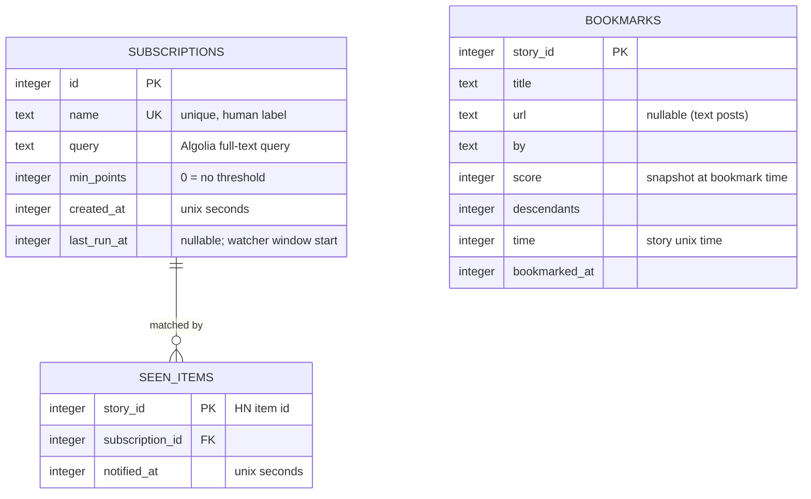

# Storage (`src/db/`)

First database in the app. `better-sqlite3` — synchronous API suits both the one-shot watcher and TUI key handlers (no await in Ink input callbacks).

## Location

1. `$HN_BITS_DB` if set.
2. Else `~/.local/share/hn-bits/hn-bits.db` (directory created on first open).

Config file stays JSON for settings; SQLite holds **data** only. WAL mode on open (`PRAGMA journal_mode=WAL`) — TUI and a cron watcher run may touch the DB concurrently.

## Schema



DDL (executed by migration, below):

```sql
CREATE TABLE subscriptions (
  id          INTEGER PRIMARY KEY,
  name        TEXT NOT NULL UNIQUE,
  query       TEXT NOT NULL,
  min_points  INTEGER NOT NULL DEFAULT 0,
  created_at  INTEGER NOT NULL,
  last_run_at INTEGER
);

CREATE TABLE seen_items (
  story_id        INTEGER NOT NULL,
  subscription_id INTEGER NOT NULL REFERENCES subscriptions(id) ON DELETE CASCADE,
  notified_at     INTEGER NOT NULL,
  PRIMARY KEY (story_id, subscription_id)
);

CREATE TABLE bookmarks (
  story_id      INTEGER PRIMARY KEY,
  title         TEXT NOT NULL,
  url           TEXT,
  by            TEXT NOT NULL,
  score         INTEGER NOT NULL,
  descendants   INTEGER NOT NULL,
  time          INTEGER NOT NULL,
  bookmarked_at INTEGER NOT NULL
);
```

Notes:

- `seen_items` PK is `(story_id, subscription_id)` — same story can legitimately notify once per subscription that matches it.
- `bookmarks` snapshots story fields so `hn bookmarks` renders without network; refreshed if the user re-bookmarks.
- No index beyond PKs/UNIQUE needed at personal-tool scale.

## Migrations (`src/db/db.ts`)

`PRAGMA user_version` counter:

```ts
openDb(): Database   // opens, sets WAL, runs pending migrations, returns handle
```

- Migrations = ordered array of SQL strings; on open, run each with index ≥ `user_version` inside a transaction, then bump `user_version`. V3 ships migration 1 (the DDL above).
- Forward-only, no down migrations (personal tool; recover = delete DB file).

## Access modules

Thin per-table modules, prepared statements, plain functions (no ORM):

```ts
// subscriptions.ts
addSubscription(name: string, query: string, minPoints: number): Subscription
listSubscriptions(): Subscription[]
removeSubscription(name: string): boolean
touchLastRun(id: number, at: number): void

// seen.ts
isSeen(storyId: number, subId: number): boolean
markSeen(storyId: number, subId: number, at: number): void

// bookmarks.ts
toggleBookmark(story: Story): boolean   // returns new state (true = now bookmarked)
listBookmarks(): Story[]                // newest bookmarked first
isBookmarked(storyId: number): boolean
```
