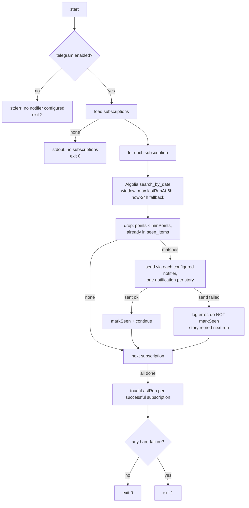

# Watcher (`src/watch.ts` — `hn watch --once`)

One-shot pass over all subscriptions; cron owns scheduling. No daemon, no `--watch` loop flag in V3.

## Invocation

```bash
hn watch --once            # the only mode; --once required (guards against
                           # accidentally running a future daemon semantics)
hn watch --once --dry-run  # print would-notify matches, no notifications sent, no seen_items writes
```

Headless Commander subcommand — never renders Ink. Output = plain log lines to stdout/stderr (cron mails or discards them).

## Flow



## Rules

- **Ordering:** subscriptions processed sequentially (rate-friendly to Algolia and Telegram); stories within one oldest-first (notifications arrive in creation order).
- **Dedup before send**, `markSeen` only **after** successful send — failed sends retry next run (idempotency via seen_items). V3.5 refines "successful send" for its best-effort desktop channel ([../v3.5/01-desktop-notifications.md](../v3.5/01-desktop-notifications.md)).
- **`touchLastRun`** updated only when the subscription's Algolia query succeeded (send failures don't block the window — seen_items handles those); Algolia failure leaves `lastRunAt` untouched so the window re-covers the gap.
- **Errors are per-subscription:** one failing query/send never aborts the others.
- **`--dry-run`:** full pipeline, prints `would notify: [sub] title (points)` lines, zero writes.

## Exit codes

| Code | Meaning |
|------|---------|
| 0 | pass completed (with or without notifications) |
| 1 | pass completed but ≥1 subscription had query/send failures (cron mail signal) |
| 2 | misconfiguration (telegram not enabled; V3.5 widens to "no notifier enabled at all") — fix before scheduling |

## Log format

```text
[2026-07-07T10:30:01Z] watch: 3 subscriptions
[2026-07-07T10:30:02Z] postgres: 2 new matches
[2026-07-07T10:30:03Z] postgres: notified 41211001 "Postgres 18 released" (312 pts)
[2026-07-07T10:30:04Z] zig-lang: no new matches
[2026-07-07T10:30:04Z] done: 2 notified, 0 failed
```

## Scheduling (documented in README, user's responsibility)

```cron
*/30 * * * * /usr/local/bin/hn watch --once >> ~/.local/share/hn-bits/watch.log 2>&1
```

macOS note: launchd equivalent acceptable; cron entry works on macOS too. 30 min default suggestion — window overlap (6 h) makes any cadence safe.
