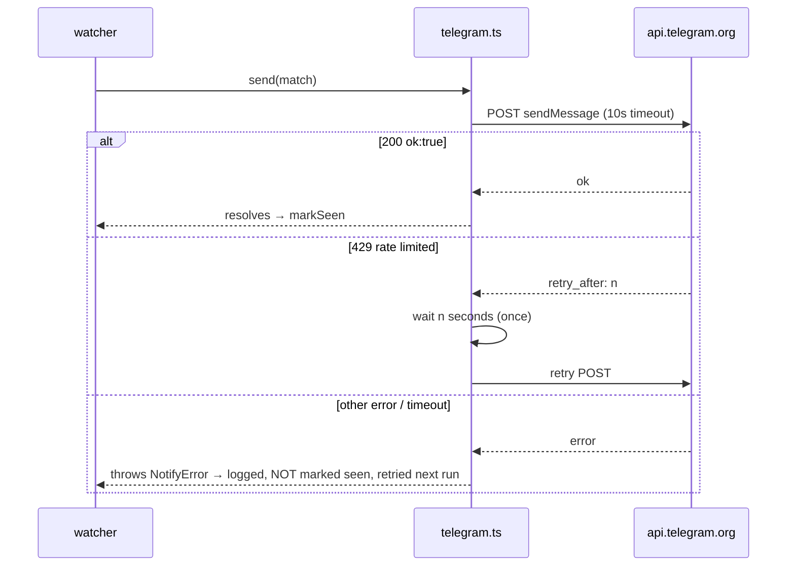

# Notifications (`src/notify/`)

Telegram + macOS desktop in V3. Interface first, so Discord later = one new file, zero watcher changes.

## Interface (`notifier.ts`)

```ts
interface Match {
  subscription: Subscription;
  story: Story;
}

interface Notifier {
  name: string;
  send(match: Match): Promise<void>;  // throws on failure; watcher handles retry semantics
}
```

Watcher takes `Notifier[]` — every configured notifier gets every match. V3 ships two implementations: `telegram.ts` and `desktop.ts`. Discord later = new `discord.ts` implementing `Notifier`, enabled by config presence.

## Config (extends V2 config file — additive keys)

```json
{
  "ollama": { "...": "..." },
  "telegram": {
    "botToken": "123456:ABC-...",
    "chatId": "987654321"
  },
  "desktopNotifications": {
    "enabled": true,
    "timeoutSeconds": 10
  }
}
```

Telegram setup (documented in README): create bot via `@BotFather` → token; message the bot once, get chat id via `getUpdates`. Both values required. Desktop: section present with `enabled: true` activates it; `timeoutSeconds` optional, default 10. Each section is independent — either alone is valid; **neither** configured = exit 2 from watcher ([03-watcher.md](03-watcher.md)).

## Telegram implementation (`telegram.ts`)

```text
POST https://api.telegram.org/bot<botToken>/sendMessage
```

```json
{
  "chat_id": "<chatId>",
  "text": "...",
  "parse_mode": "HTML",
  "disable_web_page_preview": false
}
```

Message format (HTML parse mode; title/author escaped with `&amp; &lt; &gt;`):

```text
🔔 <b>postgres</b>
<a href="https://example.com/article">Postgres 18 released</a>
312 points · 214 comments · by someauthor
<a href="https://news.ycombinator.com/item?id=41211001">HN discussion</a>
```

- Story link omitted for text posts (HN link only, becomes the title link).
- Preview left enabled — Telegram's link preview is useful context.

## Desktop implementation (`desktop.ts`)

macOS-only, via [alerter](https://github.com/vjeantet/alerter) — external CLI binary (`brew install vjeantet/tap/alerter`), **not** an npm dependency. Requires macOS 13+; some alerter features use private APIs and may break on future macOS releases — V3 sticks to the stable subset (no reply/dropdown).

- **Binary discovery:** `alerter` looked up on `PATH` once per watcher run. Missing = one stderr warning `desktop: alerter not found (brew install vjeantet/tap/alerter), skipping` and the notifier is disabled for the run. Never exit 2 — telegram unaffected.
- **Invocation:** alerter has no `-open` flag and blocks until the notification is clicked, dismissed, or times out, printing the result. So `send()` spawns a detached `sh -c` wrapper (stdio ignored, `unref()`):

```sh
r=$(alerter -title "🔔 <sub name>" -subtitle "<points> pts · <comments> comments" \
    -message "<story title>" -actions Open -timeout <timeoutSeconds> -group hn-<subId>)
case "$r" in @TIMEOUT|@CLOSED) ;; *) open "<url>" ;; esac
```

- **Click opens the story URL** (HN discussion link for text posts — same rule as the telegram message). Body click (`@CONTENTCLICKED`) and the `Open` action both open. Title and URL shell-escaped.
- **Fire-and-forget:** `send()` resolves once the wrapper spawns; the wrapper — not the watcher — waits out the interaction, lives at most `timeoutSeconds`, and exits with the notification. Watcher exit is never delayed.
- `-group hn-<subId>` replaces a subscription's stale notification instead of stacking.

## Failure handling



- One 429 retry honoring `parameters.retry_after`; anything else throws. Watcher's no-markSeen rule makes every failure eventually retried — no lost notifications, at-least-once delivery (duplicate only possible if crash lands between send and markSeen; accepted).
- Sequential sends (watcher already serial) keep volume far under Telegram limits (~1 msg/s per chat).

**Asymmetry (deliberate):** desktop is best-effort — spawn failures are logged, never throw `NotifyError`, never block `markSeen`. Telegram remains the at-least-once channel. Consequence: in desktop-only config, a spawned wrapper counts as sent, so delivery is at-most-once ([03-watcher.md](03-watcher.md)).
