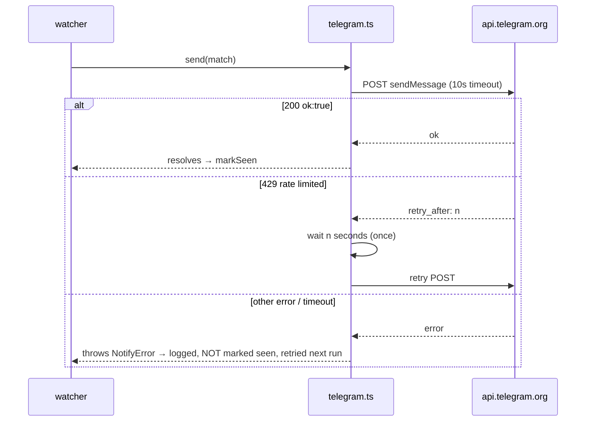

# Notifications (`src/notify/`)

Telegram only in V3. Interface first, so each later channel = one new file, zero watcher changes: macOS desktop is V3.5 ([../v3.5/01-desktop-notifications.md](../v3.5/01-desktop-notifications.md)), Discord is V3.6 ([../v3.6/01-discord.md](../v3.6/01-discord.md)).

## Interface (`notifier.ts`)

```ts
interface Match {
  subscription: Subscription;
  story: Story;
}

interface Notifier {
  name: string;
  send(match: Match): Promise<void>;  // throws on failure; watcher handles retry semantics
}
```

Watcher takes `Notifier[]` — every configured notifier gets every match. V3 ships one implementation: `telegram.ts`. Later channels (`desktop.ts` in V3.5, `discord.ts` in V3.6) each implement `Notifier`, enabled by config.

## Config (extends V2 config file — additive keys; managed via `hn config`, [../v2.5/01-config-cli.md](../v2.5/01-config-cli.md))

```json
{
  "ollama": { "...": "..." },
  "telegram": {
    "enabled": true,
    "botToken": "123456:ABC-...",
    "chatId": "987654321"
  }
}
```

```bash
hn config set telegram.enabled true
hn config set telegram.botToken 123456:ABC-...
hn config set telegram.chatId 987654321
```

Telegram setup (documented in README): create bot via `@BotFather` → token; message the bot once, get chat id via `getUpdates`. Activation is explicit: `telegram.enabled === true` (with `botToken`/`chatId` also set) turns it on. In V3, telegram not enabled = exit 2 from watcher ([03-watcher.md](03-watcher.md)); V3.5 relaxes the gate to "no notifier enabled at all". The `desktopNotifications.*` keys already shipped in V2.5 stay in `configKeys.ts` and activate in V3.5.

## Telegram implementation (`telegram.ts`)

```text
POST https://api.telegram.org/bot<botToken>/sendMessage
```

```json
{
  "chat_id": "<chatId>",
  "text": "...",
  "parse_mode": "HTML",
  "disable_web_page_preview": false
}
```

Message format (HTML parse mode; title/author escaped with `&amp; &lt; &gt;`):

```text
🔔 <b>postgres</b>
<a href="https://example.com/article">Postgres 18 released</a>
312 points · 214 comments · by someauthor
<a href="https://news.ycombinator.com/item?id=41211001">HN discussion</a>
```

- Story link omitted for text posts (HN link only, becomes the title link).
- Preview left enabled — Telegram's link preview is useful context.

## Failure handling



- One 429 retry honoring `parameters.retry_after`; anything else throws. Watcher's no-markSeen rule makes every failure eventually retried — no lost notifications, at-least-once delivery (duplicate only possible if crash lands between send and markSeen; accepted).
- Sequential sends (watcher already serial) keep volume far under Telegram limits (~1 msg/s per chat).
